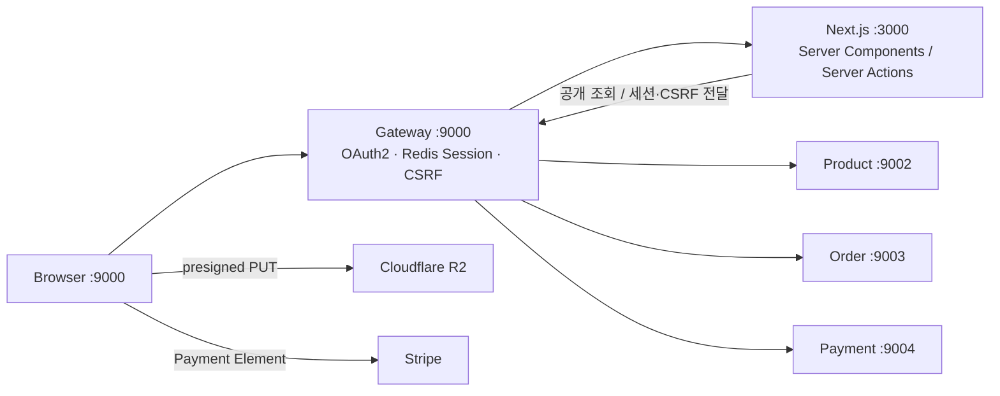

# Ecomart — E-Commerce Frontend

Next.js App Router 기반의 이커머스 프론트엔드입니다. 공개 상품 탐색, 비회원·회원 장바구니, 주문·결제, 관리자 상품 관리를 [MSA 백엔드](https://github.com/Youngwook-Jeon/ecommerce-msa)와 연동합니다.

백엔드의 비동기 주문·결제 처리를 사용자가 이해할 수 있는 화면 상태로 연결하는 데 중점을 뒀습니다. 결제 세션 준비, 결제 입력, 주문 확정 대기를 구분하고, 최종 성공 여부는 Order 서비스의 상태로 판단합니다.

## 구현 범위

| 영역 | 주요 기능 / 경로 |
|---|---|
| 스토어프론트 | 홈, 카테고리 탐색 `/categories`, 카테고리별 상품 목록 `/categories/[categoryId]` |
| 상품 목록·상세 | 키워드 검색, 브랜드·가격 필터, 정렬·페이지 이동, `/products/[productId]`의 옵션·Variant 선택 |
| 장바구니 | `/cart`, 비회원·회원 카트, 수량 변경·삭제, 카탈로그 동기화, 로그인 후 비회원 카트 병합 |
| 체크아웃 | `/checkout`, 배송지 입력·주문 생성, 결제 준비·진행·성공·실패 화면 |
| 결제 | Stripe Payment Element, Stub 결제 연동, 주문 상태 폴링 |
| 관리자 | `/dashboard/admin` 하위 상품·카테고리·글로벌 옵션 그룹 관리, 상품·옵션 이미지 업로드 |

## 연동 구조와 설계 선택



브라우저 진입점은 `http://localhost:9000`입니다. Gateway가 화면 요청을 Next.js로 프록시하고, Next.js의 서버 측 서비스가 Gateway API를 호출합니다. 직접 `:3000`에 접속하면 로그인 리다이렉트와 세션·CSRF 흐름이 달라질 수 있습니다.

### 공개 조회와 사용자별 요청 분리

| 요청 유형 | 구현 | 설계 이유 |
|---|---|---|
| 공개 상품·카테고리 | [publicGet](src/common/services/publicFetch.ts) | 사용자 쿠키 없이 조회하여 공용 응답의 캐시 경로 분리 |
| 카트·주문·결제·관리자 | [fetchWrapper](src/common/services/fetchWrapper.ts) | 요청 쿠키와 `XSRF-TOKEN`을 Gateway의 `Cookie`·`X-XSRF-TOKEN` 헤더로 전달 |
| 비회원 카트 변경·병합 | [cartService](src/services/cartService.ts) | Server Action에서 응답 `Set-Cookie`를 전달해 비회원 식별 쿠키의 생성·삭제 반영 |
| 이미지 바이너리 업로드 | [productImageUpload](src/lib/productImageUpload.ts) | 백엔드에서 URL 발급 → R2 직접 PUT → 백엔드 commit. R2에는 Gateway 세션 쿠키를 보내지 않음 |

카트·주문·결제 조회는 `no-store`로 최신 사용자 상태를 읽습니다. 공개 조회는 Zod 스키마로 외부 응답을 검증한 뒤 타입이 있는 View Model로 UI에 전달합니다.

상품 상세는 프로덕션에서 900초, 카테고리 계층은 3,600초의 재검증 주기를 사용합니다. 개발 모드에서는 해당 캐시 경로를 `no-store`로 전환합니다. 상품 상세의 metadata·page 조회는 React `cache`로 요청 내 중복을 줄입니다. 설정은 [storefrontCache](src/common/constants/storefrontCache.ts)에 모았습니다.

백엔드 Redis 캐시와 Next.js 캐시는 별개입니다. 백엔드의 캐시 무효화가 Next.js 캐시를 즉시 갱신한다는 보장은 없으며, 주문 시 가격·재고는 백엔드가 다시 검증합니다.

### 비동기 결제를 화면 상태로 표현

| 단계 / 관찰 상태 | 화면 동작 | 백엔드와의 관계 |
|---|---|---|
| 주문 생성 | `/checkout/processing/[orderId]`로 이동 | 재고 예약 후 `PENDING_PAYMENT` 주문 생성 |
| 결제 세션 준비 | client secret을 1초 간격으로 재조회, 최대 약 30초 | `order.created`의 CDC 전달·Payment 세션 생성 지연 허용. 404는 아직 준비되지 않은 상태로 취급 |
| Stripe 결제 입력 | Payment Element 표시 | 브라우저 결제 결과 뒤에도 주문 확정 대기 |
| Stub 결제 | 결제 입력을 생략하고 주문 상태 조회 | 로컬 provider의 결과를 같은 SAGA 경로로 확인 |
| `PENDING_PAYMENT` | 1.5초 간격으로 주문 조회, 최대 약 60초 | 결제 완료와 주문 확정 사이의 시간차 표현 |
| `CONFIRMED` | `/checkout/confirmation/[orderId]`, 카트 배지 갱신 | 재고 확정과 주문 상태 반영이 완료된 결과 |
| `CANCELLED` / `EXPIRED` | `/checkout/failed/[orderId]` | API에서 받은 종료 상태에 따른 화면 분기 |
| 폴링 제한 시간 초과 | 대기 안내와 “Check again” 제공 | 화면의 대기 종료를 결제 실패·주문 취소로 간주하지 않음 |

구현: [CheckoutProcessingClient](src/modules/checkout/ui/components/CheckoutProcessingClient.tsx) · [OrderStatusPoller](src/modules/checkout/ui/components/OrderStatusPoller.tsx) · [paymentService](src/services/paymentService.ts).

프론트엔드는 주문을 직접 확정하지 않습니다. 백엔드의 환불·DLT·재조정 상태를 모두 표현하는 운영 화면은 아직 없으며, 상세 보상 경로는 백엔드 README의 SAGA 표를 참고하세요. `EXPIRED` 화면 분기가 존재하는 것이 백엔드의 자동 주문 만료 실행을 의미하지는 않습니다.

## 기술 스택과 구조

Next.js **15.1.7**, React **19**, TypeScript, Tailwind CSS 3, shadcn/Radix UI, React Hook Form·Zod, Stripe.js를 사용하며 패키지 관리는 **Bun**으로 통일합니다.

```text
src/
├── app/                 # App Router 페이지·레이아웃·loading/error/not-found
├── modules/             # catalog, cart, checkout, 관리자 등 기능별 UI·로직
├── services/            # 도메인별 API 접근·Server Actions
├── common/
│   ├── services/        # fetchWrapper, publicFetch, 인증·쿠키 처리
│   ├── schemas/         # API 응답·입력 Zod 스키마와 View Model
│   └── constants/       # 스토어프론트 캐시 등 공통 설정
├── components/ui/       # 공유 UI primitives
└── lib/                 # 이미지 업로드·공통 유틸
```

Server Components로 초기 데이터를 읽고, 옵션 선택·폼·결제·폴링 같은 상호작용에 Client Components를 사용합니다. 변경 요청과 쿠키 처리는 Server Actions/서비스 계층에 모아 UI에서 인증 전달 로직이 반복되지 않도록 합니다.

## 로컬 실행

Java 21·Docker 기반 백엔드와 Bun이 필요합니다. 아래 Make 명령은 두 저장소를 포함한 **워크스페이스 루트**에서 실행합니다.

```bash
# 최초 1회만 복사. 기존 설정 파일이 있다면 유지
cp ecommerce-msa/.env.example ecommerce-msa/.env
make check-prereqs
make up

# 별도 터미널에서 프론트엔드 실행
make frontend
```

프론트엔드 디렉터리에서 직접 실행할 수도 있습니다.

```bash
cd ecommerce-frontend
bun install
bun run dev
```

브라우저에서 `http://localhost:9000`에 접속합니다. 기본 백엔드 설정은 `PAYMENT_PROVIDER=stub`, `R2_ENABLED=false`로, 외부 결제·스토리지 자격 증명 없이 로컬 흐름을 확인할 수 있습니다. 실제 R2 업로드 검증은 별도 설정이 필요합니다.

`make down`은 백엔드와 인프라를 중지합니다. 별도 터미널의 프론트엔드 개발 서버는 해당 터미널에서 종료합니다.

### Stripe 테스트 결제

1. 백엔드 `ecommerce-msa/.env`에 `PAYMENT_PROVIDER=stripe`와 `STRIPE_API_KEY`를 설정합니다.
2. 프론트엔드 `ecommerce-frontend/.env.local`에 `NEXT_PUBLIC_STRIPE_PUBLISHABLE_KEY`를 설정합니다.
3. 로그인된 Stripe CLI를 준비하고 워크스페이스에서 `make up` 또는 `make apps`를 실행합니다. 로컬 스크립트가 webhook secret을 프로세스 환경에 주입하고 포워딩을 시작합니다.
4. 프론트엔드를 다시 실행한 뒤 체크아웃합니다.

비공개 Stripe API 키와 webhook secret은 프론트엔드에 넣지 않습니다. `.env`·`.env.local`은 커밋하지 않습니다.

### 관리자 로그인

`/dashboard/admin/**`는 Keycloak 로그인과 `ADMIN` 역할이 필요합니다. 기본 로컬 Realm의 개발용 계정은 `lucas@lucas.com` / `password`입니다. 로그인은 Gateway에서 진행합니다.

## 실행·검증 명령

```bash
# ecommerce-frontend 디렉터리
bun run dev
bun run lint
bun run build
bun run start
```

자동화된 프론트엔드 테스트 스위트는 아직 구성하지 않았습니다. lint·프로덕션 빌드 외에 다음 연동 시나리오를 수동 확인합니다.

| 시나리오 | 확인할 결과 |
|---|---|
| 비로그인 상품 탐색 | 목록 필터·정렬·상세 옵션 선택, 접근 불가 상품의 오류 화면 |
| 비회원 카트 → 로그인 | 카트 쿠키 유지, 회원 카트 병합과 배지 갱신 |
| 체크아웃 중 가격·재고 변경 | 변경 내역을 검토한 뒤 다시 주문할 수 있는지 확인 |
| Stub / Stripe 테스트 결제 | 처리 화면에서 실제 주문 상태를 따라 성공·실패 화면으로 이동 |
| 결과 반영 지연 | 제한 시간 이후 실패로 단정하지 않고 재조회 제공 |
| 관리자 이미지 업로드 | presign → R2 PUT → commit과 이미지 표시 확인 |

## 트러블슈팅과 현재 제약

| 증상 | 확인 사항 |
|---|---|
| 401 또는 로그인 반복 | `:9000` 접속 여부, Gateway·Keycloak·Redis 상태 |
| 변경 요청 403 | `XSRF-TOKEN` 쿠키·`X-XSRF-TOKEN` 전달, 관리자 역할 |
| 결제 세션 준비 지연 | Order·Payment 실행, Kafka Connect 커넥터 상태, provider session 작업 오류 |
| 결제 뒤 주문 확정 지연 | `payment.completed` 소비, 재고 예약 만료, DLT·백엔드 재조정 상태 |
| 관리자 변경이 공개 화면에 늦게 반영 | 프로덕션 Next.js 재검증 주기와 백엔드 캐시 확인 |
| R2 업로드 실패 | 백엔드 R2 설정과 버킷 CORS의 `http://localhost:9000`·PUT 허용 여부 |

Gateway 주소는 현재 [fetchWrapper](src/common/services/fetchWrapper.ts)의 `BASE_API_URL`에 로컬 주소로 지정돼 있습니다. 배포 시 서버 간 접근 주소와 공개 origin을 환경에 맞게 분리해야 합니다. 브라우저 E2E 테스트와 환불·운영 상태 UI는 후속 개선 과제입니다.
